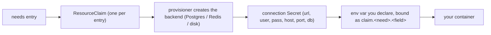

# Writing Application.cue

AppRafter applications are described by a CUE manifest that lives
in the `apprafter/` directory of your repository. When you push the
repository, Argo CD detects the `.cue` files, runs the CUE
Config-Management-Plugin (CMP) sidecar to compile them, and passes
the resulting Kubernetes YAML to its sync pipeline. The AppRafter
operator then reconciles the `Application` CR into a Deployment and
Service.

You do not maintain a separate rendered-output branch or run a
local pre-commit step. Edit CUE, commit, push — GitOps handles
the rest.

## The canonical filename

Place your manifest at `apprafter/Application.cue` in the root
of your repository (or the repository path you registered with
`apprafter app add`). The CMP decides whether a repository is CUE by
running a shell probe from `spec.source.path` and checking whether it
printed anything:

```yaml
discover:
  find:
    command:
      - sh
      - -c
      - |
        if [ "$(basename "$PWD")" = "apprafter" ]; then
          find . -maxdepth 1 -type f -name '*.cue' -print -quit
        else
          find . -type f -name '*.cue' \( -path '*/apprafter/*' -o -name 'apprafter*.cue' \) -print -quit
        fi
```

So a file is picked up when **either** it sits anywhere under an
`apprafter/` directory — whatever it is called, which is why
`apprafter/Application.cue` works — **or** its own filename starts
with `apprafter`. The special case at the top handles a
`spec.source.path` that already points *at* the `apprafter/`
directory: there, any `.cue` file directly inside it matches.

The recommended layout is `apprafter/Application.cue`. Bear in mind
that every `.cue` file under `apprafter/` is compiled, not just the
one named `Application.cue`, and that a stray `apprafter-notes.cue`
elsewhere in the repo also matches the second branch.

For a monorepo with multiple services, each service can have its
own `apprafter/Application.cue`. Control which paths Argo CD
rescans on each push with the
`argocd.argoproj.io/manifest-generate-paths` annotation on the
Argo CD `Application` CR — for example
`manifest-generate-paths: /parser,/shared-schemas`.

## Minimal manifest

```cue
// apprafter/Application.cue
package apprafter

import v1alpha1 "apprafter.io/schemas/v1alpha1"

app: v1alpha1.#Application & {
    metadata: {
        name:      "my-service"
        namespace: "apprafter"   // matches app add --namespace default
    }
    spec: base: {
        image:    "ghcr.io/my-org/my-service:1.0.0"
        replicas: 1
        expose: {
            port:    8080
            network: "internal"
        }
        env: {
            LOG_LEVEL: "info"
        }
    }
}
```

### Field reference

All fields live under `spec.base` (or `spec.environments.<env>` for
overrides — see below). The Rust operator mirrors this exactly via
`ApplicationSpec { base, environments }`.

| Field             | Type                        | Notes                                               |
| ----------------- | --------------------------- | --------------------------------------------------- |
| `image`           | `string`                    | OCI image reference. Required (via base or all envs). |
| `imagePolicy.resolve` | `"digest" \| "off"` (default `"digest"`) | `digest`: the operator re-resolves the tag to its current registry digest every reconcile, so pushing a moved tag rolls the Deployment. `off`: render the reference verbatim. |
| `replicas`        | `int & >=0`                 | Zero is valid (scale-to-zero). Defaults to 1 at render time. |
| `resources.requests` / `resources.limits` | `[string]: string` | Container resource requests/limits keyed by resource name (`cpu`, `memory`, `ephemeral-storage`), valued as Kubernetes quantities (`"100m"`, `"128Mi"`). The webhook checks the quantity format and `request <= limit`. |
| `expose.port`     | `int & >0 & <=65535`        | Container port to expose. Required when `expose` is set on `base`. |
| `expose.network`  | `"public" \| "internal" \| "vpn"` (default `"internal"`) | Visibility. `public` emits an HTTPRoute on the platform Gateway; `internal` is ClusterIP only; `vpn` is reserved and rejected by the webhook today. |
| `expose.hostname` | `string \| [...string]`     | One or more public hostnames. Read only when `network: "public"`, where the webhook requires it and checks each is a DNS-1123 subdomain. |
| `expose.tls`      | `bool` (default `true`)     | Terminate TLS. The public route attaches to `:443`, so `tls: false` with `network: "public"` is webhook-rejected. |
| `env`             | `[string]: string \| {claim: string} \| {secret: string}` | A literal string, or a reference to a claim field or a sealed secret — see *Referencing claims and secrets* below. |
| `needs`           | `#Needs`                    | Declared platform-service dependencies — see *Declaring dependencies* below. |
| `environments`    | `[string]: override`        | Per-environment overrides. Lives under `spec`, not `spec.base` — see *Multi-environment patterns* below. |

The admission webhook enforces non-empty `image` and the
cross-field rule (image must be reachable through `spec.base.image`
or every `spec.environments[*].image`). The CRD OpenAPI schema
rejects negative replicas and out-of-range port numbers.

### Declaring dependencies — the `needs` block

`spec.base.needs` declares the backing services and storage your
workload requires. The operator provisions each on demand (a
`ResourceClaim` per entry), pauses the Application until they are
ready, and writes the connection details to a `Secret`. Nothing is
injected into your container automatically: you name the env-vars you
want and bind them to claim fields yourself (see *Referencing claims
and secrets* below).



The Application stays paused at `AwaitingResourceClaim` until every
claim is ready, so your container never starts without the connection
details it binds.

```cue
spec: base: {
    image:    "ghcr.io/my-org/api:1.0.0"
    replicas: 1
    needs: {
        pg:    { selector: { tier: "integrated" }, size: "small" }
        redis: { selector: { tier: "integrated" } }
        disk:  { size: "1Gi", mountPath: "/data" }
    }
}
```

| Need | What you get | How you reach it |
| ---- | ------------ | ---------------- |
| `pg` | A Postgres database + role (CloudNativePG). | A connection `Secret` keyed `url`, `user`, `pass`, `host`, `port`, `db` — referenced as `claim.pg.<field>`. |
| `redis` | An isolated Redis-compatible logical DB (Dragonfly). | A connection `Secret` keyed `url`, `user`, `pass`, `host`, `port`, `db`, `channelPrefix` — referenced as `claim.redis.<field>`. |
| `disk` | A persistent `ReadWriteOnce` volume. | Mounted at `mountPath` (pins `replicas: 1`, `strategy: Recreate`). |

**Named, multiple dependencies.** Each key accepts a single entry
(above) **or an array of named entries**. A named entry provisions
its own claim, addressed by name as `claim.<type>.<name>.<field>`:

```cue
needs: {
    pg: [
        { name: "primary",   selector: { tier: "integrated" } },
        { name: "analytics", selector: { tier: "integrated" } },
    ]
    disk: [
        { name: "uploads", size: "5Gi", mountPath: "/var/uploads" },
        { name: "cache",   size: "1Gi", mountPath: "/var/cache" },
    ]
}
```

Here the two databases are reached as `claim.pg.primary.url` and
`claim.pg.analytics.url` (an unnamed single `pg` stays plain
`claim.pg.url`). Each disk mounts at its own path. Within a type,
every `name` (or, for an unnamed disk, the last `mountPath` segment)
must be unique, and at most one entry per type may be unnamed.

`apprafter app scaffold --needs <pg|redis|disk>` (repeatable) emits
a starter `needs` block for you. The full operational guides —
provisioning, isolation, retention, and GC — live in the operator
guide: [Postgres](../operator-guide/postgres.md),
[Redis](../operator-guide/redis.md),
[persistent disk](../operator-guide/persistent-disk.md).

### Referencing claims and secrets

An `env` value is one of three things: a literal string, a **claim
reference**, or an **external secret reference**. The operator resolves
the latter two into a Kubernetes `secretKeyRef`, so the value itself
never appears in your manifest or in Git (ADR 0046).

```cue
spec: base: {
    image: "ghcr.io/my-org/api:1.0.0"
    needs: {
        pg:    { selector: { tier: "integrated" } }
        redis: { selector: { tier: "integrated" } }
    }
    env: {
        LOG_LEVEL:    "info"                    // literal
        DATABASE_URL: claim.pg.url              // claim reference
        DB_HOST:      claim.pg.host             // any decomposed field
        REDIS_URL:    claim.redis.url
        STRIPE_KEY:   secret: "stripe/api-key"  // external secret
    }
}
```

**You choose the env-var names.** Declaring `needs.pg` provisions a
database and writes its connection `Secret`; it does not put anything in
your container's environment. An app that wants `DATABASE_URL` must bind
it, as above.

`claim.<type>.<field>` — or `claim.<type>.<name>.<field>` for a named
entry — is a bare CUE selector. The `claim` value is generated from your
own `needs` block by the CUE CMP at render time, and by `apprafter app
validate` locally, so referencing a field you did not provision is a
compile error rather than a runtime surprise. The available fields are
exactly the connection-`Secret` keys listed in the table above; `disk`
has none, since a volume is mounted rather than referenced.

`secret: "<name>/<key>"` reads a `Secret` **in the application's own
namespace**. Create it with
[`apprafter secret seal`](../reference/cli/secret.md) — and pass that
namespace explicitly, because `secret seal` defaults to
`apprafter-system` (where platform credentials live). A sealed secret is
bound to the namespace it was sealed for; if the app cannot find it the
operator reports `EnvSecretMissing`.

### Egress profiles — `needs` also gates the network

Declaring a network need does more than wire a connection string: it
opens the **only** path your pods have to that backend. The operator
emits one egress `CiliumNetworkPolicy` per Application that selects your
pods on egress (making them default-deny on egress) and allows DNS,
same-namespace traffic, the external internet, and exactly the in-cluster
services you declared. An app with `needs.pg` can reach the shared
Postgres; an app **without** it cannot — the attempt is dropped at the
Cilium datapath. So if a workload talks to an in-cluster backend, declare
it as a need; an undeclared reach is denied by design.

How wide the baseline is depends on a cluster-wide posture, the
`PlatformStack.spec.network.egress.profile`, which a platform operator
sets with `apprafter platform egress set <profile>`:

| Profile | Baseline allows (besides your declared needs) |
| --- | --- |
| `internet` (default) | DNS + same-namespace + the external internet. |
| `internal` | DNS + same-namespace (no external internet). |
| `strict` | DNS only (even same-namespace egress is denied). |

The per-need allow rules are emitted at **every** profile — tightening the
profile never blocks a declared dependency. `needs.disk` adds no egress
rule (a mounted volume has no network target). The full guide — observing a
Hubble drop, flipping the profile — is the operator guide's
[egress gated by declared dependencies](../operator-guide/egress-policy.md).

## Multi-environment patterns

`spec.environments` holds per-environment overrides. Which one applies
is a property of the deployment, not of the cluster: `apprafter app add
--env staging` registers a deployment carrying
`spec.environment: "staging"`, and the operator unifies
`spec.environments.staging` onto `spec.base` before rendering
(ADR 0044). Register the same manifest twice with different `--env`
values and you get two independent deployments from one file — [Deploying
more than one environment](environments.md) covers that end to end,
including the namespaces the two deployments need.

Merge rules, per field:

- `image`, `replicas` — **replace**: a value set in the environment
  overwrites the base value.
- `expose`, `imagePolicy` — **merge per subfield**: fields the
  environment sets win, fields it omits inherit from base — so an
  environment overriding only `network` keeps the base `port`.
- `resources` — **merge per key** inside `requests` and `limits`, so an
  environment setting `limits.memory` does not drop the base
  `limits.cpu`.
- `env` — **merge with override-wins**: base env-vars are preserved
  and environment-specific vars are added; if the same key appears
  in both, the environment value wins.
- `needs` — **replace per service key**: an environment entry for `pg`
  replaces the base `pg` wholesale; base-only keys survive.

```cue
// apprafter/Application.cue
package apprafter

import v1alpha1 "apprafter.io/schemas/v1alpha1"

app: v1alpha1.#Application & {
    // No `metadata.namespace` here on purpose: a manifest that pins
    // one renders the same object for every environment, so the two
    // deployments would collide. Leave it out and each deployment
    // takes the namespace you pass to `apprafter app add --namespace`.
    metadata: name: "parser"
    spec: {
        base: {
            image:    "ghcr.io/my-org/parser:1.2.0"
            replicas: 2
            expose: {
                port:    8080
                network: "internal"
            }
            env: {
                LOG_LEVEL: "info"
                DB_HOST:   "postgres.svc"
            }
        }
        environments: {
            dev: {
                replicas: 1
                env: {
                    LOG_LEVEL: "debug"   // overrides base LOG_LEVEL
                }
            }
            prod: {
                replicas: 5
                expose: {
                    // `port` inherits from base (subfield merge)
                    network:  "public"
                    hostname: "parser.example.com"
                }
            }
        }
    }
}
```

Registered with `apprafter app add --env dev`, the operator renders:

- `image`: `ghcr.io/my-org/parser:1.2.0` (from base, no dev override)
- `replicas`: 1 (dev overrides base)
- `expose`: `port: 8080`, `network: "internal"` (base unchanged)
- `env`: `{ LOG_LEVEL: "debug", DB_HOST: "postgres.svc" }` (merge, dev wins on LOG_LEVEL)

With `--env prod`:

- `image`: `ghcr.io/my-org/parser:1.2.0`
- `replicas`: 5
- `expose`: `port: 8080` inherited from base, `network: "public"` and
  `hostname` from prod (subfield merge)
- `env`: `{ LOG_LEVEL: "info", DB_HOST: "postgres.svc" }` (base unchanged)

Registered without `--env`, the operator uses `spec.base` directly
without applying any environment overlay.

## How the CUE CMP works

The CUE plugin runs in a sidecar container named `cue-cmp`, inside
the Argo CD `argocd-repo-server` pod. When Argo CD clones a repository
and the discovery probe above prints a match, the sidecar runs its
`entrypoint.sh`, which does three things worth knowing about:

1. **It changes directory into `apprafter/`** when `spec.source.path`
   pointed at a parent. Everything below runs from the package
   directory.
2. **It writes the schema and the `claim` binding into your checkout**
   — a workspace-local CUE module holding the exact
   `apprafter.io/schemas/v1alpha1` the sidecar image ships, plus a
   generated `apprafter_claim_gen.cue` that defines the `claim` value
   your `env` references resolve against (ADR 0046). Both are
   inject-wins: they overwrite anything you vendored. This is why you
   do not vendor the schema yourself, and why bare
   `claim.pg.url` selectors resolve without you declaring them.
3. **It exports each manifest separately.** A single
   `cue export ./... --out yaml` would emit your named top-level values
   (`app: …`, `web: …`) as keys of one YAML document, which Argo CD
   would reject as a manifest with no `apiVersion`. So the sidecar
   exports to JSON, enumerates the top-level values that look like
   Kubernetes objects (`apiVersion` + `kind` present), and re-exports
   each one on its own with `cue export ./... -e <key> --out yaml`,
   separated by `---`. Top-level helper values that are not Kubernetes
   objects are skipped rather than emitted.

The sidecar is installed and kept up to date by the platform-stack
chart; no manual sidecar configuration is required on your part.

## Troubleshooting compile errors

When CUE compilation fails, Argo CD surfaces the error in the
Application sync status. The sync operation shows `ComparisonError`
or `SyncError`; the full error output is in the sync log.

### Viewing the error

In the Argo CD UI: open the Application → click the sync status
badge → expand the error accordion. The CMP wrapper normalizes
CUE errors to a single-line summary in the badge, with the full
`cue export` stderr in the expandable details.

??? note "Reading the same thing from a shell"

    ```sh
    # Argo CD Application sync state.
    kubectl get applications.argoproj.io <app-name> -n argocd \
        -o jsonpath='{.status.conditions}'

    # The CMP sidecar's log, for the full cue output. The container is
    # named `cue-cmp` — `argocd-cue-cmp` is the image, not the container.
    kubectl logs -n argocd deploy/argocd-repo-server -c cue-cmp --tail=50
    ```

### Common errors

**`package "apprafter.io/schemas/v1alpha1" not found`**

The import path must match exactly. Confirm the `package` directive
at the top of your file and the import string.

Do **not** vendor the schemas into your repository. The sidecar lays
its own bundled copy down inject-wins before rendering, so a schema
you vendored under your own `<your-repo>/cue.mod/pkg/` tree is
overwritten at sync time and only diverges from what actually renders.
`apprafter app scaffold` stopped vendoring in ADR 0046 for exactly
this reason. The one place vendoring still matters is running `cue` by
hand — use `apprafter app validate`, which lays out the same workspace
the sidecar does.

**`field not allowed: <field-name>`**

The CUE schema uses `close()` semantics in some contexts. Check
that you are only writing fields declared in `#ApplicationSpec`.
`needs` is supported (see *Declaring dependencies* above); fields
from future spec versions (`autoscale`, `confidential`) are not yet
in v1alpha1 and will produce this error.

**`conflicting values ... (mismatched types)`**

A CUE unification conflict. Typically caused by assigning a string
to an integer field or vice versa. Check `expose.port` (integer),
`replicas` (integer), and `env` values (a literal string, or a `claim` /
`secret` reference — see *Referencing claims and secrets*).

**Admission-webhook rejection after sync**

If CUE compiles cleanly but the operator status shows a webhook
error, the issue is a cross-field invariant the CRD OpenAPI schema
cannot express. Common causes:

- `image` is empty in `spec.base` and not present in every
  `spec.environments[*]` entry. Every environment that lacks its own
  `image` inherits from base; if base has no image either, the
  webhook rejects the CR.
- `env` key does not match `^[A-Z_][A-Z0-9_]*$`. Lowercase or
  special characters in env-var keys are rejected.
- `env` key contains a character outside DNS-1123 (dot, slash, etc.).

## Registering your application

After committing and pushing `apprafter/Application.cue`, register
the repository with Argo CD so it tracks your repo:

```sh
# From the root of your application repository:
apprafter app add

# Or with an explicit URL:
apprafter app add https://github.com/my-org/my-service.git
```

`app add` creates an Argo CD `Application` CR that points at your
repository. The CUE CMP kicks in on the first sync and the
AppRafter operator reconciles the generated `Application` CR into
a running Deployment.

## Where to look next

- [`schemas/v1alpha1/application.cue`](https://github.com/apprafter/apprafter/blob/master/schemas/v1alpha1/application.cue)
  — the CUE schema `#Application` and `#ApplicationSpec` are defined
  here. This is the authoritative field list.
- [`operator/operator-core/src/application.rs`](https://github.com/apprafter/apprafter/blob/master/operator/operator-core/src/application.rs)
  — the Rust mirror of the schema.
- [`operator/operator-rendering/src/lib.rs`](https://github.com/apprafter/apprafter/blob/master/operator/operator-rendering/src/lib.rs)
  — `effective_spec()`, where the per-environment merge rules above are
  implemented.
- [ADR 0029](../adr/0029-cue-cmp.md) — CUE CMP design rationale.
- [ADR 0044](../adr/0044-per-environment-deploy.md) — why the active
  environment is a per-deployment property.
- [ADR 0046](../adr/0046-env-value-references.md) — the `claim` /
  `secret` env-value references.
- [`examples/applications/parser.cue`](https://github.com/apprafter/apprafter/blob/master/examples/applications/parser.cue)
  — a worked multi-environment example.
- [`docs/dev-guide/quickstart.md`](./quickstart.md) — scaffold and
  register a first Application end-to-end.
