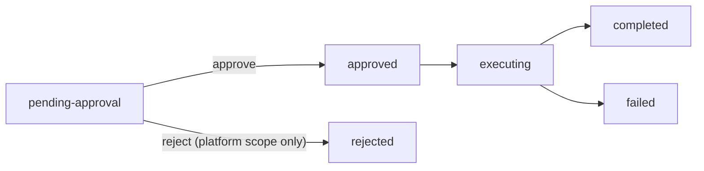

# How the approval gate works

Why the platform pauses a change instead of applying it, and why the three
scopes behave differently. The recipes are
[Migration plans](../operator-guide/migration-plans.md) for the operator and
[When a change needs approval](../dev-guide/when-a-change-needs-approval.md) for
the developer; neither needs any of this.

The gate lives inside the operator's own reconcile rather than at Argo CD's
sync layer — [ADR 0025](../adr/0025-gitops-control-surface.md) is why, and it
is the decision that makes the gate work identically whether the change arrived
through Git, through `kubectl edit`, or through the CLI. One CRD covers all
three scopes by [ADR 0027](../adr/0027-migrationplan-unification.md);
application scope was added by
[ADR 0051](../adr/0051-app-scope-migration.md).

## Why only one scope can be rejected

`MigrationPlan` carries a `spec.scope.type` discriminator with three
values — `application`, `platform` and `sourcecredential`. The approval
semantics differ: only `platform` can be rejected.

### Application scope

**Approve only.** There is no reject action for application-scope
plans.

The application manifest lives in the user's Git repository. If
you want to reverse a change, revert the commit in your source repo.
Argo CD synchronizes the reverted manifest; the operator observes
it as a non-destructive (or differently-destructive) change and the
original `MigrationPlan` is superseded automatically.

The admission webhook enforces this model: attempting to patch
`status.phase=rejected` on an application-scope `MigrationPlan`
is denied at the API server layer (per
[ADR 0027](../adr/0027-migrationplan-unification.md)). There is no
`apprafter migration reject` for application scope.

The plan is created in the **application's own namespace** with a
controlling `ownerReference` back to the `Application` CR
([ADR 0051](../adr/0051-app-scope-migration.md)).
Kubernetes garbage-collects it if the application is deleted, and it
renders inside the user's Argo CD application tree without any extra
anchor resource, so the "Approve" resource action appears on the plan
node.

While a `MigrationPlan` is pending, the application's
`status.phase` reads `AwaitingMigrationApproval` and a
`MigrationPending` condition is emitted with the plan name. Child
resources (Deployment, Service) continue running the previous spec.
On approval the operator applies the new spec, re-stamps its baseline,
and deletes the plan — the plan is a one-shot ticket, so approving it
applies-and-clears rather than re-creating a new gate.

### Platform scope

**Approve or reject.** The platform target lives in the cluster
(`PlatformStack` CR), not in a user-controlled Git repository.

- **Approve** — the `PlatformController` proceeds with the upgrade:
  it patches the umbrella Argo CD Application and Argo CD reconciles
  the new platform-stack version.
- **Reject** — the controller reverts `PlatformStack.spec.pin` to
  the value recorded in the plan's previous-spec snapshot. The
  cluster remains on the current version.

### SourceCredential scope

**Approve only**, on the same reasoning as application scope: the
gated change is a coverage *removal* on a config object, so there is
no controller-side state to roll back. The admission webhook denies
`status.phase=rejected` on a `sourcecredential` plan by any path, with
the message *"sourcecredential-scope MigrationPlans cannot be
rejected; … sourcecredential-scope plans are approve-only"*. To back
out, re-widen the credential's spec — the stale plan is collected and
derivation resumes with the wider coverage.

The plan lives in the credential's own namespace (`apprafter-system`
for the credentials `apprafter repo creds add` writes) with a
controlling `ownerReference` back to the `SourceCredential`, so
deleting the credential collects the plan too.

## Lifecycle

A `MigrationPlan` moves through these phases:

A plan sits at `pending-approval` until someone acts on it; approval is
the gate, and nothing downstream runs until it is given.

Plans in `pending-approval` state remain there indefinitely — there
is no automatic expiration. If you want to dismiss a platform-scope
plan without approving it, use `apprafter migration reject`. For an
application-scope plan, revert the triggering commit in Git; for a
`sourcecredential` plan, re-widen the credential's spec.

For an application-scope plan the operator **deletes** the plan once it
applies the approved spec — the plan is a consumed ticket
([ADR 0051](../adr/0051-app-scope-migration.md)) — so an approved application plan
does not linger in `completed`. A
`sourcecredential` plan is consumed the same way — the controller
derives both halves with the narrowed spec, stamps the new baseline,
and then deletes the plan.

## See also

- [Migration plans](../operator-guide/migration-plans.md) — approving one, and
  the sixteen application edits that create one.
- [When a change needs approval](../dev-guide/when-a-change-needs-approval.md) —
  the same sixteen, as edits a developer makes.
- [The repository's architectural specification](https://github.com/apprafter/apprafter/blob/master/spec.md),
  §3.8 — the full `MigrationPlan` field reference. A roadmap document, not
  published on this site.
