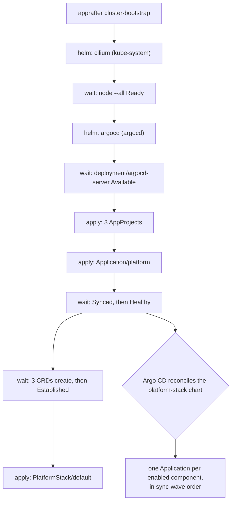

# What cluster-bootstrap installs

What `apprafter up` puts on a fresh node, and where the CLI stops. The recipe is
the [Operator quickstart](../operator-guide/quickstart.md); running it needs
none of this.

Read it when a component is running at a version you did not choose, when
bootstrap stopped at one of its waits and you want to know which step was
blocking and why it cannot be skipped, or when something you switched off in a
manifest came up anyway.

The split this page is about — the CLI installs only enough to get Argo CD
running, and everything else is an Argo CD `Application` that Argo CD
reconciles from a chart — is
[ADR 0025](../adr/0025-gitops-control-surface.md). That the chart is CUE source
in this repository, published as an OCI artefact rather than as committed YAML,
is [ADR 0028](../adr/0028-platform-stack-distribution.md).

## What the CLI installs

`apprafter cluster-bootstrap` — phase three of `apprafter up`, and the same code
when you run it on its own — performs two Helm releases and three applies, and
nothing else:

- Helm release `cilium` in `kube-system`, from the `cilium/cilium` chart;
- Helm release `argocd` in `argocd`, from the `argo/argo-cd` chart;
- three Argo CD `AppProject`s — `default`, `platform` and `platform-providers`;
- one Argo CD `Application` named `platform` in `argocd`, pointing at the
  `platform-stack` chart in `ghcr.io/apprafter`;
- the singleton `PlatformStack` named `default` in `apprafter-system`, carrying
  the tier of the active target, `channel: stable`, and — on Tier 1 —
  `autoUpgrade: true`. The CRD's own default is `false`; bootstrap flips it
  deliberately, because a single-node cluster with nobody watching it is worse
  served by a platform that never moves than by one that does.

Everything else an operator expects on the list — cert-manager, the Gateway API
CRDs, the AppRafter CRDs, the operator, the admission webhook, the default-deny
NetworkPolicy — arrives afterwards, applied by Argo CD from the chart that root
`Application` points at. The CLI installs none of them, and there is no flag
that makes it.

All three applies are server-side, under field manager `apprafter-cli`. That is
load-bearing rather than stylistic: the in-cluster PlatformController treats any
other writer on the root Application's source fields as an unauthorized
modification, so a client-side apply here would leave a freshly bootstrapped
cluster reporting one.

The whole sequence lives in one file,
`cli/platform-cli/src/commands/cluster_bootstrap.rs`, whose numbered comments
run 0 through 5 in the order the diagram below shows.

## Why the order is the order

**Cilium first, because nothing else can schedule.** The cloud-init block from
phase one installs k3s with five of its defaults switched off —
`--flannel-backend=none`, `--disable-network-policy`, `--disable-kube-proxy`,
`--disable=traefik`, `--disable=servicelb`
(`cli/cli-providers/src/hetzner_cloud/user_data.rs`). The node therefore comes
up with no CNI at all and carries `node.kubernetes.io/not-ready:NoSchedule`. The
Cilium DaemonSet tolerates that taint and schedules anyway; Argo CD's
pre-install hook Job does not, and would sit `Pending` until the Helm install
timed out. So Cilium is installed first and the loader then waits for
`node --all` to report `Ready` — 180 seconds, which is dominated by the Cilium
image pull.

**Argo CD before the root Application**, because the `Application` CRD arrives
with Argo CD. Applying the root Application before `argocd-server` is Available
fails with `no matches for kind`. The wait is on the Deployment's `Available`
condition, 180 seconds.

**AppProjects before the root Application**, because the upstream Argo CD chart
this loader installs renders no `AppProject` from its `configs.projects` values
— only the umbrella chart's own template does, and that cannot run until the
root Application syncs, which requires the project it names to already exist.
The loader therefore applies the three itself, mirroring the umbrella's output
(sync-wave `-30`, the same labels and the same permissive specs) so Argo CD
adopts them cleanly on the first sync. A fourth project, `apps` — the one
`apprafter app add` puts an application in by default — sits in the same map,
and the loader even passes it to Argo CD in its values. It is inert there until
the chart brings the object itself.

**Synced before Healthy.** A freshly created root Application with zero rendered
children reports `Healthy` trivially, because there is nothing to be unhealthy;
its sync status is what says whether Argo CD actually pulled the chart. So the
loader waits for `Synced` first and `Healthy` second, ten minutes each.

**Then the CRDs, in two stages each.** `kubectl wait` errors immediately on a
resource that does not exist rather than polling for it to appear, and root-App
`Healthy` can fire in a window where the operator component has not applied its
CRDs yet. So for each of `applications.apprafter.io`,
`platformstacks.apprafter.io` and `sourcecredentials.apprafter.io` the loader
waits `--for=create` (ten minutes) and then `--for=condition=Established` (sixty
seconds). The two-stage wait also forces a fresh discovery resolution for the
apply that follows.

**The PlatformStack last, with retries.** Its apply passes through the
`platformstacks.apprafter.io` validating webhook, whose backing pod may still
have no Endpoints even once the CRD is Established — the CRD and the webhook are
separate child Applications. The loader retries the apply up to 30 times, ten
seconds apart.

## What arrives as a chart component

The umbrella chart has essentially one template: it iterates over
`.Values.components` and emits one Argo CD `Application` per enabled entry, with
that component's sync wave, namespace, source and values
(`platform-stack/cue/render_tool.cue`). Adding a component is a CUE file, not a
template change.

| Component | Wave | Namespace | Version declared in |
| --- | --- | --- | --- |
| `gateway-api-crds` | -25 | `default` (nominal) | `platform-stack/cue/component_gateway-api-crds.cue` |
| `cilium` | -20 | `kube-system` | `platform-stack/cue/loader_values.cue` |
| `argocd` | -15 | `argocd` | `platform-stack/cue/loader_values.cue` |
| `cert-manager` | -10 | `cert-manager` | `platform-stack/cue/component_cert-manager.cue` |
| `sealed-secrets` | -8 | `apprafter-system` | `platform-stack/cue/component_sealed-secrets.cue` |
| `cloudnative-pg` | -5 | `cnpg-system` | `platform-stack/cue/component_cloudnative-pg.cue` |
| `dragonfly-operator` | -5 | `dragonfly-system` | `platform-stack/cue/component_dragonfly-operator.cue` |
| `vpa` | -4 | `vpa` | `platform-stack/cue/component_vpa.cue` |
| `apprafter-operator` | 0 | `apprafter-system` | `platform-stack/cue/component_apprafter-operator.cue` |
| `admission-webhook` | 0 | `apprafter-system` | `platform-stack/cue/component_admission-webhook.cue` |
| `network-policies` | 0 | `default` | `platform-stack/cue/component_network-policies.cue` |
| `backstage` | 0 | `backstage` | `platform-stack/cue/component_backstage.cue` |

The waves are ordering constraints, not preferences. Cilium is the prerequisite
for every pod; the Gateway API CRDs must exist before Cilium reconciles with its
gateway controller enabled; cert-manager's webhook must have Endpoints before
the admission-webhook chart applies its `Certificate`, or the apply fails with
`no endpoints available`; the VPA CRDs must be Established before the operator
emits its first autoscaler object.

Two of these components are the ones the loader already installed. Their
Applications carry the same release name and namespace as the loader's Helm
releases, so Argo CD **adopts** those releases rather than installing a second
copy, and then owns their values and upgrades from there. Every component
defaults to automated sync with prune and self-heal on; Argo CD's own component
is the one that sets `prune` to false, so a stale chart can never prune the
thing doing the pruning.

Three things in the chart are not components:

- The eight AppRafter CRDs ship inside the `apprafter-operator` chart at
  sync-wave `-5`, ahead of the operator Deployment
  (`operator/charts/apprafter-operator/templates/`).
- The `apprafter-selfsigned` `ClusterIssuer` ships inside the admission-webhook
  chart, because that chart's `Certificate` references it by name
  (`operator/charts/apprafter-admission-webhook/templates/clusterissuer.yaml`).
- The umbrella renders four `ServiceProvider` seeds — `pg-integrated`,
  `redis-integrated`, `disk-local` and `shared-local` — at wave 5, after the
  operator has installed their CRD
  (`platform-stack/cue/service_providers.cue`), plus the anchor ConfigMap that
  makes a platform `MigrationPlan` clickable in the Argo CD tree.

The `network-policies` component is worth naming precisely, because its name
promises more than it delivers today: it syncs
`manifests/tier-1/network-policies/`, which is one ingress-only `NetworkPolicy`
in the `default` namespace, admitting same-namespace pods and `kube-system`. It
has no egress rules. Per-application egress is a separate mechanism — see
[Egress derived from declared dependencies](egress-policy.md).

## Where a pinned version comes from

Four different chains, and knowing which one you are looking at is most of
answering "why is this component on that version".

**Cilium and Argo CD, at loader time, come from the CLI binary.** Their chart
versions are declared once in `platform-stack/cue/loader_values.cue`, and
`cli/cli-providers/build.rs` lifts them — along with the values files the loader
installs them with — into compile-time constants when the CLI is built. So the
`apprafter` release you ran pins what the loader installs, and the chart's own
Cilium and Argo CD components derive their values from that same CUE block by
unification rather than restating it. That construction exists because the two
did once drift, and the crash it caused was in the running cluster rather than
in a build.

**Every other component's version is the `version:` field in its own
`component_<name>.cue` file**, forwarded verbatim into the child Application's
`targetRevision`. The chart is the single source of "which Cilium do we ship";
nothing tracks `latest`.

**The operator and webhook images are not pinned in the chart at all.** Their
components pin a *chart* version in `ghcr.io/apprafter/charts` and deliberately
leave the image tag empty, so the chart's own `appVersion` decides the tag
(`operator/charts/apprafter-operator/Chart.yaml`). Releasing a new operator is
therefore a chart publish plus a component bump — no CLI release is involved.

**The platform-stack chart version itself is resolved at bootstrap time.** The
loader asks the upstream GitHub releases stream for the highest
`platform-stack/v*` tag and pins the root Application to it, preferring stable
over prerelease; on any network, parse or empty-result failure it falls back to
the version baked in from `currentVersion` in `platform-stack/cue/platform.cue`,
so an air-gapped install still bootstraps
(`cli/cli-providers/src/k8s/channel_latest.rs`). After that first pin the CLI is
out of the picture: the in-cluster controller owns the version, which is
[How the platform upgrades itself](platform-upgrades.md).

To check any of this on a running cluster rather than in the tree, open
`apprafter open argocd` — each component Application shows the target revision
it is syncing. That field is also the fallback
`apprafter platform freeze <component>` lands on: it reads
`PlatformStack.status.componentVersions.<component>` first, and drops to the
child Application's target revision when nothing has written that.

## What is off on Tier 1

The chart's default `values.yaml` **is** the rendered Tier-1 overlay
(`platform-stack/cue/tier_solo.cue`), so "the shipped defaults" and "Tier 1" are
the same document. What that overlay switches off:

- **Backstage.** Off in the component's own default and left off here; most solo
  installs do not run an internal portal.
- **Hubble**, Cilium's observability layer, including its relay and UI. The
  Tier-2 overlay turns all three on.
- **`argocd-cue-cmp` as a standalone Application** — and this one is not really
  a capability being withheld. The CUE plugin runs as a sidecar container inside
  `argocd-repo-server`, injected through the Argo CD component's values, so it
  has no Application of its own and the component entry stays disabled to keep
  the umbrella from rendering one. It does mean the plugin is absent from the
  loader's Argo CD install and appears only once the chart adopts that release.
  See [GitOps and the CUE plugin](gitops-and-the-cue-cmp.md).

Two more things produce nothing until you ask for them, which reads the same
from the outside: the platform `Gateway` and its HTTP-to-HTTPS redirect are
rendered only when the chart has at least one allowed domain, and the off-site
backup CronJobs only once `apprafter backup enable` has flipped the flag the
controller projects into chart values.

And two are installed but idle. The CloudNativePG and Dragonfly operators are
on at Tier 1 — each is one small Deployment — but neither seeds a database or a
cache. Those are created lazily on the first matching claim, so a cluster with
no such application pays no Postgres or Redis pod cost. See
[Declared Postgres dependencies](needs-pg.md) and
[Declared Redis dependencies](needs-redis.md).

The tier number itself does less than it looks. The CLI writes the active
target's tier into `PlatformStack.spec.values.tier`, the controller forwards it
into the umbrella's Helm values, and the umbrella uses it in exactly one place:
the `apprafter.io/tier` label it stamps on every rendered Application. The
component *set* comes from the values document, and the Tier-2 set ships in the
chart as a separate example values file rendered from
`platform-stack/cue/tier_team.cue`.

## What bootstrap does not read

`cluster-bootstrap` reads the active target and the cached kubeconfig. It does
not read an `Infrastructure` manifest at all. So `spec.operator.enabled` and
`spec.admissionWebhook.enabled` are inert: both binaries arrive as chart
components, and a manifest that disables them changes nothing. The fields still
parse — they are in the schema, which is why they still look like they should
work.

## Re-running it

The whole path is idempotent, and re-running it is the supported repair.

Each Helm release is fingerprinted over its chart, version, values content and
overrides; if the release is already deployed at that fingerprint the loader
skips the upgrade entirely rather than bumping the Helm revision, and a CLI
upgrade that changes any of those inputs flips the fingerprint so the upgrade
does run. The three applies are server-side under a stable field manager, so
they converge rather than conflict. The waits return immediately when their
conditions already hold.

`apprafter platform rescue` is the same chain behind a confirmation prompt, for
when Argo CD cannot self-adopt and the normal upgrade path cannot reach a good
reconcile state.

## See also

- [Operator quickstart](../operator-guide/quickstart.md) — the recipe this page
  is behind, and the only commands you need to run it.
- [How the platform upgrades itself](platform-upgrades.md) — what owns the chart
  version after bootstrap, and the four reasons an upgrade can be waiting.
- [GitOps and the CUE plugin](gitops-and-the-cue-cmp.md) — what the sidecar in
  `argocd-repo-server` does once Argo CD is adopted by the chart.
- [The target store on disk](the-target-store.md) — where the tier, region and
  credentials the loader reads are kept.
- [ADR 0025](../adr/0025-gitops-control-surface.md) — why the loader is minimal
  and the platform reconciles itself.
- [ADR 0028](../adr/0028-platform-stack-distribution.md) — why the chart is CUE
  in this repository and an OCI artefact everywhere else.
