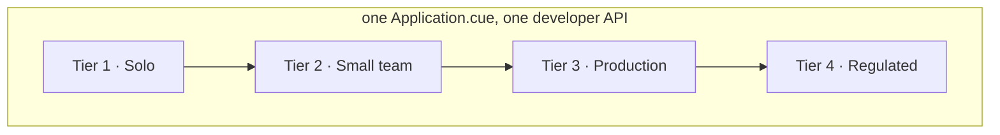

# AppRafter

**Opinionated, vertically-integrated Platform-as-a-Service on
Kubernetes — the same `Application` manifest from a €5 VDS to
confidential bare metal.**

You describe an application once, in CUE. The platform provisions its
dependencies, exposes it, and keeps it in sync from Git — the same way
on a single €5 server as on confidential bare metal.

## An application, described once

```cue
package example

import v1alpha1 "apprafter.io/schemas/v1alpha1"

api: v1alpha1.#Application & {
	metadata: {name: "api", namespace: "demo"}
	spec: base: {
		image:    "ghcr.io/my-org/api:1.4.0"
		replicas: 2
		expose: {port: 8080, network: "public", hostname: "api.example.com"}
		needs: pg: {selector: {tier: "integrated"}, size: "small"}
	}
}
```

That `needs: pg` line is the whole point: you ask for Postgres, and the
platform provisions it, wires the connection `Secret` in, and pauses the
rollout until it is ready. The same manifest does this on every tier.

With a cluster running, shipping it is three commands:

```sh
apprafter app scaffold     # writes apprafter/Application.cue for the repo you are in
apprafter app validate     # checks it against the platform schema, locally
apprafter app add          # registers it; Argo CD deploys it and keeps it synced from Git
```

## Where to start

- **[Operator Guide](operator-guide/index.md)** — you run the cluster:
  provision a machine, bootstrap the platform, connect a domain, take
  backups. Start here if you own the infrastructure.
- **[Developer Guide](dev-guide/index.md)** — you ship applications onto
  a cluster someone runs: write `Application.cue`, declare dependencies,
  reference secrets, iterate. Start here if you own the app.
- **[Reference](reference/index.md)** — every custom resource, every CLI
  command (generated from the binary), every environment variable.
- **[ADRs](adr/README.md)** — the reasoning behind each architectural
  choice, one decision per record.

For machine readers, `/llms.txt` is a curated index of these guides,
`/llms-guides.txt` bundles the indexed guides on their own,
`/llms-full.txt` bundles the whole corpus, and every page is also served
as markdown at its own URL with the trailing `/` swapped for `.md`.

## The tier model

The developer-facing API above is identical across four hardware tiers.
Migrating between them is a platform operation, not a manifest rewrite.



| Tier              | Persona                    | Hardware                  | Cost         |
| ----------------- | -------------------------- | ------------------------- | ------------ |
| **1. Solo**       | Solo founder, side-project | 1× VDS (Hetzner CX22+)    | €5–20/mo     |
| **2. Small team** | 3–10 engineers             | 3× CCX or small dedicated | €50–200/mo   |
| **3. Production** | Established product        | 3–5× dedicated EPYC       | €500–2000/mo |
| **4. Regulated**  | Compliance / sovereignty   | TDX/SEV-SNP, confidential | €2000+/mo    |

Tiers 2–4 are on the roadmap — multi-node and observability land in
[Phase 3](https://apprafter.dev/#roadmap-phase-tier2),
bare-metal Tier 3 in
[Phase 5+](https://apprafter.dev/#roadmap-phase-tier3),
and confidential Tier 4 in
[Phase 6+](https://apprafter.dev/#roadmap-phase-tier4).

## Status

Pre-MVP (managed offering). Active development.
