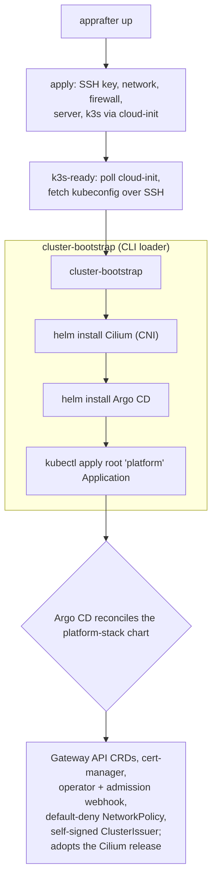

# Operator quickstart

You are a cluster operator standing up AppRafter on Hetzner Cloud.
This page covers the **three-step CLI flow** that gets you from a
blank Hetzner account to a self-managing cluster in one session.

For the developer perspective ("I want to deploy my first app"),
see [Developer quickstart](../dev-guide/quickstart.md).

## What you will build

| Component         | Tier-1 baseline                                                        |
| ----------------- | ---------------------------------------------------------------------- |
| Substrate         | One Hetzner Cloud server, of the type you pick in step 1, in `nbg1` (or your region). |
| Network           | Hetzner private network 10.0.0.0/16, subnet 10.0.0.0/24.              |
| Firewall          | TCP 22 (SSH) + 6443 (kube API) + 80/443 (HTTP/S) + UDP 51820 (WG).    |
| Kubernetes        | k3s single-node (traefik + servicelb disabled).                        |
| CNI               | Cilium 1.16.5 (kube-proxy replacement, IPAM kubernetes).               |
| Gateway           | Gateway API CRDs + Cilium gateway.                                     |
| GitOps            | Argo CD 7.7.7 (single replicas, Dex off).                              |
| TLS               | cert-manager 1.16.2 + self-signed `apprafter-selfsigned` issuer.       |
| Application CRD   | `apprafter.io/v1alpha1.Application` (admission-validated).             |

**Important:** the platform does not stop at Argo CD installation. After
`up` completes, Argo CD adopts the platform stack itself — Cilium,
cert-manager, the AppRafter operator, the admission webhook — and reconciles it
from a versioned OCI chart. You do not install the operator by hand; the
platform installs and upgrades itself through GitOps.

## Prerequisites

Get the `apprafter` CLI onto your `PATH`. You do not need a repository
checkout — the release binary is the normal path, and this page assumes
nothing else:

```sh
curl -fsSL https://apprafter.dev/install.sh | sh
```

The installer detects your platform, resolves the newest release,
downloads the archive with its `.sha256`, and **verifies the checksum
before installing** — a download it cannot verify is refused rather than
installed. To read it before running it:
`curl -fsSL https://apprafter.dev/install.sh -o install.sh`, then
`sh install.sh`. `APPRAFTER_VERSION` pins a tag and
`APPRAFTER_INSTALL_DIR` chooses the destination.

Prebuilt targets are Linux `x86_64`, macOS `x86_64` and macOS `aarch64`;
Linux `aarch64` is not published yet, so ARM servers need a source
build. [apprafter.dev/download](https://apprafter.dev/download/) lists
the archives and their checksums for a manual install, and the
[developer quickstart](../dev-guide/quickstart.md#install) spells out the
source and Nix alternatives.

While you are there, install shell completion —
`apprafter completion <shell>` prints the script and the
[recipe per shell](../dev-guide/quickstart.md#shell-completion) says
where to put it. Every command on this page becomes one Tab away, which
saves the most typing on the deeply nested ones such as
`apprafter target firewall cloudflare-origin enable`.

You will also need:

- A Hetzner Cloud API token with Read+Write access.
- An SSH key whose **public** half you will hand to the provider for
  the new node. The CLI never touches the private half.
- **`kubectl` on your `PATH`.** Not optional: the CLI shells out to it
  for every cluster-facing command, and `apprafter doctor` reports a
  missing `kubectl` as a failure rather than a warning.
- **`helm`** for `cluster-bootstrap`, **`restic`** for backup and
  restore, **`git`** for reading an application repository, and an
  **SSH client** for node preparation. Each is needed only by the
  commands that use it, so `doctor` reports a missing one as a warning
  naming the capability you will not have.

Any command that needs a tool checks for it **before** it prompts for
anything, contacts a cluster or creates a billable resource, and names
the install steps when it is absent.

Confirm all five now, before step 1 and before anything is billable:

```sh
apprafter doctor
```

With no target configured it reports `active target: none configured` as
a warning and exits 0, and still prints one line per tool —
`kubectl` `helm` `git` `ssh` `restic` — plus a DNS reachability check. A
missing `kubectl` is the only FAIL; the rest warn and name the capability
you would lose. Step 3 runs it a second time, when there is a target for
its six target-side checks to read.

The rest of this page assumes `apprafter` is on `PATH`.

## Step 1 — Configure a target

A **target** bundles `(provider, region, credentials, defaults)`
under a name. One command saves it; future commands reuse it.

```sh
apprafter target add prod
```

On a TTY this runs a wizard: it asks for the name, provider, token, SSH
key and tier, validates the token against the Hetzner API, and then opens
the **live machine matrix** — one row per (region × machine type) with
price and availability — so the region and the server type are chosen
together and saved on the target. That is the whole of step 1; there is
nothing to look up first.

Scripted, or on a machine with no TTY, name the same things as flags:

```sh
apprafter target add prod \
    --provider hetzner-cloud \
    --token  "<your-hcloud-token>" \
    --region nbg1 \
    --tier   solo \
    --ssh-key ~/.ssh/id_ed25519.pub \
    --server-type <sku>
```

!!! warning "The server type has no default — step 2 fails without it"
    Provisioning is a spending decision, so AppRafter refuses to guess
    a machine class. The
    resolution chain is `--server-type` flag → manifest
    `spec.nodes[0].type` → recorded state → target default →
    `APPRAFTER_SERVER_TYPE`, and if every rung is empty `apprafter
    up` aborts with
    `apprafter::provider::server_type_not_selected` before creating
    anything.

    The wizard above already made this choice. `apprafter target machine`
    is how you set it on a target created non-interactively, or change it
    later — and it is the only way to change it: `target add <existing>`
    errors and `--renew` is credentials-only. It refuses once a server has
    been provisioned, because changing the machine of a live cluster is a
    rebuild, not an edit.

    ```sh
    apprafter target machine          # the same matrix, on its own
    apprafter target machine --server-type <sku>   # non-interactive
    ```

    A committed `Infrastructure` manifest is a fourth rung, read from a
    path on the machine running the CLI and named by `APPRAFTER_MANIFEST`.
    It is not a cluster object and there is no GitOps path for it; only
    `apply` reads it. The target store is where the CLI keeps the substrate
    settings. See [Choosing the machine](./choosing-the-machine.md) and
    [environment variables](../reference/environment.md).

The first target on a fresh store is auto-activated. To check:

```sh
apprafter target list           # (alias: apprafter t ls)
apprafter target show           # (alias: apprafter t info)
apprafter whoami                # one-line identity + active target
```

Credentials are stored in `~/.config/apprafter/targets/prod/` at
mode 0600. The CLI never echoes the token value in `show`/`whoami`
output. See [The target store on disk](../how-it-works/the-target-store.md) for the full
file layout and the credential resolution chain (flag → env → store).

## Step 2 — Bring the cluster up

Run one command to provision and bootstrap the entire tier-1 stack:

```sh
apprafter up                    # (alias: apprafter bootstrap-all)
```

This runs three phases under a unified progress display:

1. **`apply`** — provisions the SSH key, private network, firewall,
   the server of the type you chose in step 1, and a `#cloud-config`
   user-data block that installs fail2ban + k3s. Around 30 s on the
   Hetzner side;
   cloud-init needs another 90–180 s after that.
2. **`k3s-ready` (poll)** — waits for cloud-init + k3s to finish
   on the new node, then retrieves the kubeconfig over SSH.
   The kubeconfig lands age-encrypted in `.apprafter/state.json`.
3. **`cluster-bootstrap`** — installs Argo CD (the bootstrap
   loader), then applies a root Argo CD `Application` that points
   at the platform-stack OCI chart. Argo CD reconciles all remaining
   platform components — Cilium, Gateway API CRDs, the AppRafter
   Application CRD, default-deny NetworkPolicy, cert-manager,
   self-signed ClusterIssuer, apprafter-operator, and the
   admission webhook — from that chart without further CLI
   intervention.



The CLI installs only what the node needs to schedule Argo CD (Cilium,
then Argo CD itself); everything past the root Application is Argo CD's
to reconcile from the chart.

Preview before spending a Hetzner cent:

```sh
apprafter up --dry-run
```

The dry-run prints the resolved target name, every field from
`config.yaml`, and the three-phase plan. No provider calls.

Each phase also has its own subcommand for partial re-runs. The
labels match what `up` prints as it runs:

```sh
apprafter apply                 # [1/3] apply alone
apprafter kubeconfig --refresh  # [2/3] k3s-ready alone (force re-fetch over SSH)
apprafter cluster-bootstrap     # [3/3] bootstrap alone (re-runs the loader)
apprafter cb                    # alias for cluster-bootstrap
```

## Step 3 — Verify

```sh
apprafter doctor                # self-diagnostic, exits 1 on FAIL
```

The second run is the one that exercises the six target-side checks the
Prerequisites run could not: the config file, the credentials file and its
mode, the provider, the token format, a token ping, and the SSH key. Each
check reports PASS / WARN / FAIL with a hint pointing at the right next
command.

Then ask whether anything is wrong with the cluster:

```sh
apprafter status
```

`status` is the roll-up: the target, the platform's version and any
unhealthy condition, applications reporting problems, applications held at
a digest, and MigrationPlans awaiting approval. Right after
`cluster-bootstrap` returns, the platform's components take a few minutes
to settle, so a condition here that is not yet healthy is expected.
`apprafter platform status` is the detail view behind that line — version
history and component versions — and `apprafter node status` reports the
node's own posture.

??? note "Reading the same thing with kubectl"

    ```sh
    apprafter kubeconfig > /tmp/kc && export KUBECONFIG=/tmp/kc

    kubectl get nodes                          # the one node, STATUS Ready
    kubectl -n argocd get pods                 # argocd-server + repo-server Running
    kubectl get applications.apprafter.io -A   # empty until you deploy an app
    ```

The cloud-init block installs k3s from `https://get.k3s.io` without
pinning `INSTALL_K3S_VERSION`, so the `VERSION` column reports
whichever k3s is current stable on the day you provision, not a
version this page can name.

### Open the Argo CD UI

```sh
apprafter open argocd
```

This command starts a local port-forward to Argo CD, prints the
admin username and password, and opens your default browser at
`https://localhost:8080`. No separate `kubectl port-forward` or
`apprafter argocd-password` dance is needed.

In the UI you will see the platform-stack Argo CD `Application`
and its child components. Each should be **Synced** and **Healthy**
within a few minutes of `cluster-bootstrap` completing.

### Smoke: deploy something

The operator and the admission webhook arrive with the platform stack, so
`platform status` reporting them healthy already says the reconcile path is
up. To prove it end to end, deploy a real application the way you will
always deploy one — scaffold a manifest, register it, watch it come up:

```sh
apprafter app scaffold --name parser --namespace default
apprafter app add <git-url> --name parser --namespace default
apprafter app status parser
```

The [developer quickstart](../dev-guide/quickstart.md) walks that in full,
including the repository side.

Deploying by `kubectl apply` of an `Application` CR is deliberately not
shown here. It works, and it is the wrong first habit: the platform's
control surface is Git plus the CLI, and a hand-applied CR is drift Argo CD
will fight with on its next sync. `kubectl apply` against a cluster is
reserved for emergency overrides.

!!! note "There is no opt-out for the operator or webhook"
    Both arrive as components of the platform-stack chart that Argo CD
    reconciles, so `spec.operator.enabled` and
    `spec.admissionWebhook.enabled` have no effect —
    `cluster-bootstrap` reads no `Infrastructure.cue` at all. The
    fields still parse; their removal is tracked in
    `docs/measurements/schema-followups.md`.

## Day-2 operations

| Task                          | Command                                                  |
| ----------------------------- | -------------------------------------------------------- |
| Open Argo CD UI               | `apprafter open argocd`                                  |
| List Applications             | `apprafter app list`                                     |
| Argo CD admin password only   | `apprafter argocd-password`                              |
| Re-fetch kubeconfig           | `apprafter kubeconfig --refresh` (alias: `apprafter kc --refresh`) |
| Rebuild local state           | `apprafter import` (live Hetzner → state.json)           |
| Switch active target          | `apprafter target use <name>` (alias: `apprafter t use`) |
| Rotate the Hetzner token      | `apprafter target add <name> --renew --token <new>`      |
| Inspect target config         | `apprafter target show` (alias: `apprafter t info`)      |
| Platform version / status     | `apprafter platform status`                              |
| Upgrade platform              | `apprafter platform upgrade --to <version>`              |
| Tear down                     | `apprafter destroy --yes` — every `apprafter=true` resource in the token's project, not one cluster ([scope](target-store.md#destroy-scope)) |

The credential resolution chain (flag → env → target store) means
all of the above work without an explicit `HCLOUD_TOKEN` export
once the target is configured. CI keeps the env-var path working
unchanged.

## When things go wrong

Each error renders with a stable `apprafter::<area>::<reason>`
diagnostic code and a multi-line `help:` block. Examples:

```text
Error: apprafter::target::not_found

  × target `ghost` not found (available: prod)
  help: Either the `--target` flag was given a name that's not in the store,
        or no target has been created yet. List existing targets with
        `apprafter target list`; create a new one with `apprafter target add
        <name> --provider hetzner-cloud …`. If the store is empty (`available:
        ` shows nothing), this is your first run — start with `apprafter
        target add`.
```

Set `NO_COLOR=1` for CI / pipe consumers. Output stays
byte-identical to the pre-colour baseline.

## Where to look next

- [Managing targets](./target-store.md) — target store layout +
  credential resolution chain reference.
- [Troubleshooting](./troubleshooting.md) — diagnostic-code
  catalogue, common failures, recovery commands.
- [Private repos & registries](../dev-guide/private-repos-and-registries.md)
  — `apprafter repo creds add`, the one credential Argo CD clones a
  private repository with and the node pulls a private image with, and
  the token-scope rules that differ between the two.
- [Platform management](./platform-management.md) — platform
  version lifecycle, release channels, upgrade and freeze.
- [CLI reference](../reference/cli/index.md) — full subcommand
  reference with every flag + alias.
- [Developer quickstart](../dev-guide/quickstart.md) —
  scaffold and deploy a first Application.
